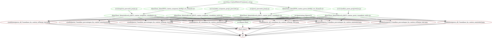

# swiss_population

## Aim of the Project

This project is intended to explore and expand my data analysis skills in Python and R.  

This dataset will be explored to answer the question of where non permanent residents, specifically Canadians, lived in Switzerland in 2016. The hypothesis for this project is the majority (>50%) of non permanent residents born outside of Switzerland, specifically Canada, lived in cantons containing major city centres in 2016. For this project, major city centres are defined as Zurich, Geneva, Basel, Lausanne, and Bern, as all have populations greater than 125,000 inhabitants. 

In order to summarize the data, proportions of non permanent residents living in city centres were be calculated. This includes filtering for Canadians. The data was be visualized as proportions on a map of Switzerland, generated using R. The final report can be viewed as a [pdf](https://github.com/jdubchak/swiss_population/blob/master/swiss_population/doc/report.pdf) or [markdown document](https://github.com/jdubchak/swiss_population/blob/master/swiss_population/doc/report.md). 

## The Data

The data for this project was manually collected from the [Swiss STAT-TAB](https://www.pxweb.bfs.admin.ch/pxweb/en/px-x-0102010000_104/-/px-x-0102010000_104.px) website for the year 2016, and the 4 files can be found [here](https://github.com/jdubchak/swiss_population/tree/master/swiss_population/data/raw_data). 

## Requirements

This project was completed using Python 3, and `pandas` `v0.20.1`, and figures were generated in R, using `tidyverse` `v1.1.1`, `ggplot2` `v2.2.1` and `ggswissmaps` `v0.1.1`. As required by Milestone 3, the project release can be found [here](https://github.com/jdubchak/swiss_population/releases/tag/v3.0). 

## Reproducibility

This project runs 9 scripts contained in the `src` directory. There are 3 ways to reproduce this project: using the [driver script](https://github.com/jdubchak/swiss_population/blob/master/driver.sh), [Makefile](https://github.com/jdubchak/swiss_population/blob/master/Makefile), or the bash command [docker pull jdubchak/swiss_population](https://hub.docker.com/r/jdubchak/swiss_population/). First, please clone this repository and navigate to the project root directory, `swiss_population`. 

To reproduce the project using the driver script, execute the following command on your command line.

`sh driver.sh` 

To reproduce the project using the Makefile, execute the following command on your command line.

`make all` 

To reproduce the project using docker, execute the following commands on your command line.

`docker pull jdubchak/swiss_population`

`docker run -it --rm -v your_local_pathway:/home/swiss_population jdubchak/swiss_population /bin/bash` 

 

## Author
Jordan Dubchak, December 2017. 

