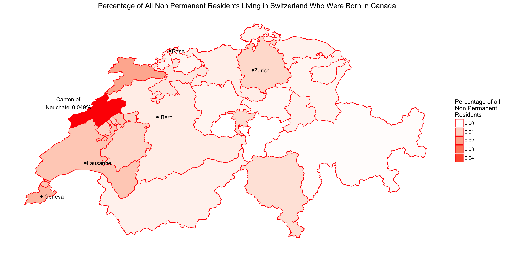
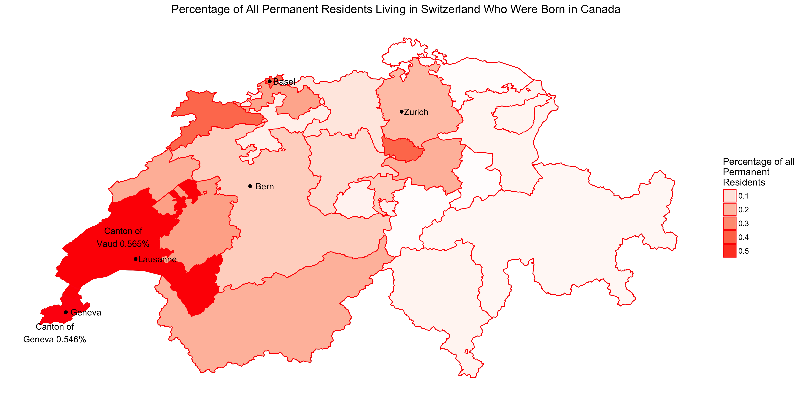
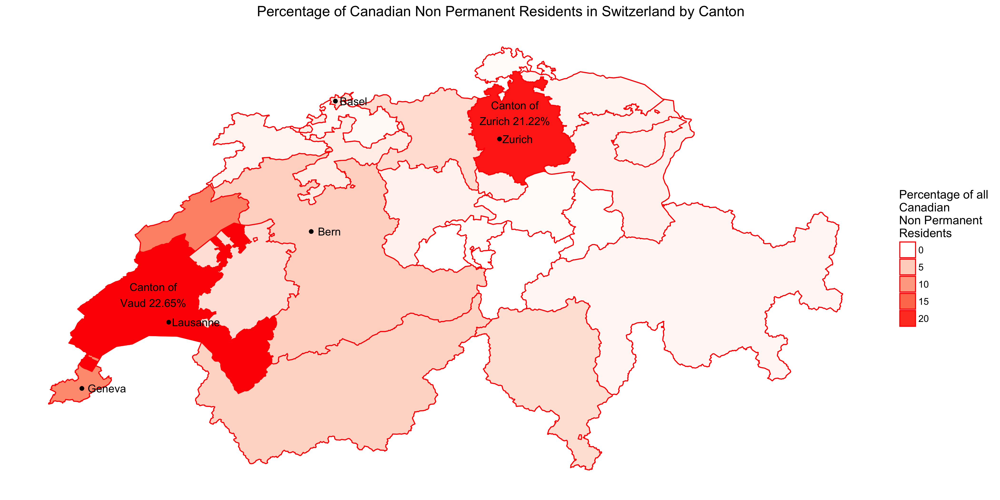
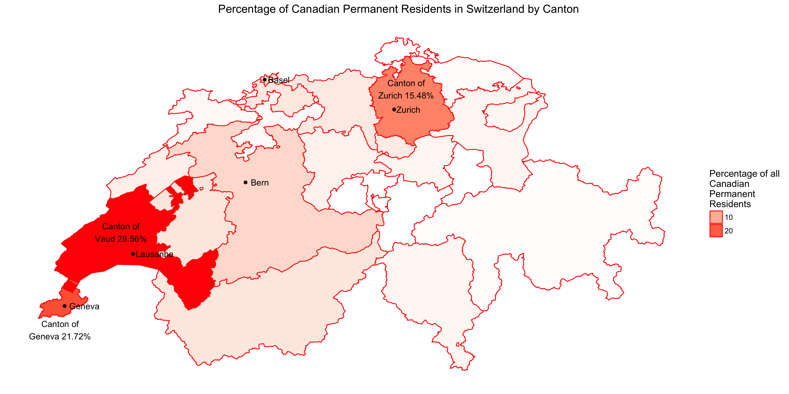
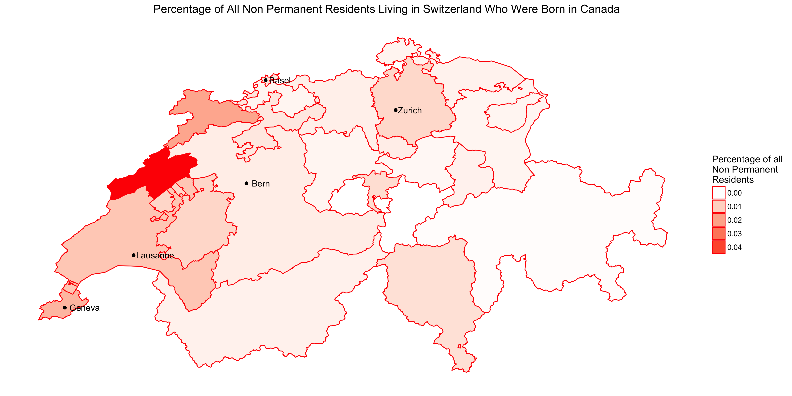
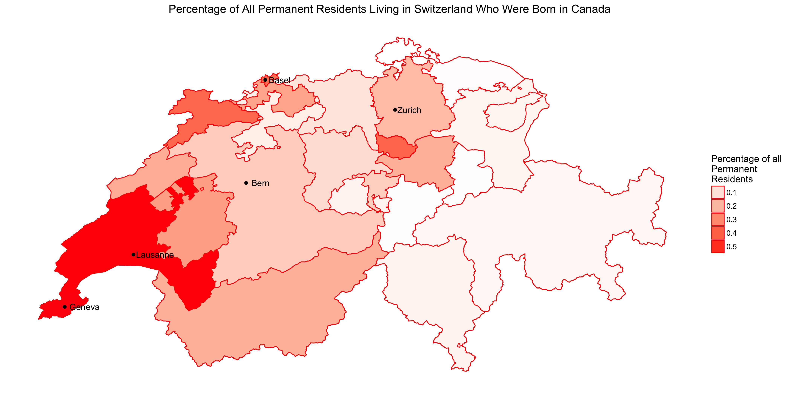
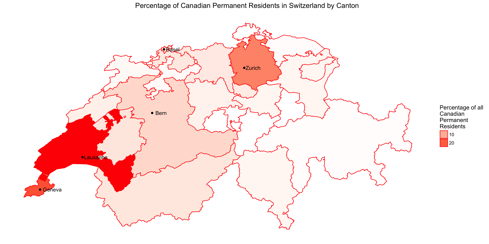

```{r setup, include=FALSE}
knitr::opts_chunk$set(echo = TRUE)
```

```{r, echo=FALSE, warning=FALSE}
suppressMessages({
  library(knitr)
  library(tidyverse)
})
```

## Introduction

Switzerland is consistently ranked among the top countries having the highest quality of life due to its economic offerings, public transportation, health care, and landscape[^1][^2]. Switzerland is also noted for the quality of life and employment opportunities offered to foreigners[^3][^4]. Out of personal curiosity, I was interested to find out how many non permanent and permanent residents were born in Canada, and where they reside. The goal is to determine whether the larger city centres, including Basel, Bern, Geneva, Lausanne, and Zurich, were home to Canadians living abroad. 

## Methods 

All data was manually collected from a Swiss government website, [STAT-TAB](https://www.pxweb.bfs.admin.ch/pxweb/en/px-x-0102010000_104/-/px-x-0102010000_104.px), for the year 2016, and can be found in the [raw data folder](https://github.com/jdubchak/swiss_population/tree/master/swiss_population/data/raw_data). The data was cleaned in Python, using `pandas` (v0.20.1), and figures were generated in R, using `tidyverse` (v1.1.1), `ggplot2` (v2.2.1) and `ggswissmaps`(v0.1.1). All figures were generated using the `shp[["g1k15"]]` dataframe from `ggswissmaps`, and cantons were mapped from the data to this dataframe. Two statistics were generated, the proportion, represented as percentages, of all non permanent and permanent residents who are Canadian by canton $\frac{Canadian np/p}{all np/p}$, and the proportion, also represented as percentages, of Canadian non permanent and permanent residents by canton $\frac{Canadians in Canton}{All Canadians}$. Extra figures without annotations are included in the appendix. 

## Results

### Non Permanent and Permanent Residents who are Canadian


#### Non Permanent Residents 

Table 1: Extreme Values of Proportion (%) of all Non Permanent Swiss Residents Born in Canada, 2016

```{r, echo=FALSE, warning=FALSE}
canton_nonperm_Canadians_bornabroad <- suppressMessages(readr::read_csv("../data/clean_data/reduced_g1k15_canton_nonperm_canadians.csv"))
colnames(canton_nonperm_Canadians_bornabroad)[11:12] <- c("Percent", "Proportion")
canton_nonperm_Canadians_bornabroad <- canton_nonperm_Canadians_bornabroad %>% 
  group_by(cantons) %>% 
  select(cantons, Percent) %>% 
  summarize(Percent_prop = max(Percent)) %>% 
  arrange(desc(Percent_prop))

canton_nonperm_Canadians_bornabroad_reduced <- canton_nonperm_Canadians_bornabroad %>% 
  filter(Percent_prop > 1.5 | Percent_prop <0.2) %>% 
  mutate(Percent_prop = round(Percent_prop, 2))
colnames(canton_nonperm_Canadians_bornabroad_reduced) <- c("Canton", "Percentage")
kable(canton_nonperm_Canadians_bornabroad_reduced, position="centre", caption = "Extreme Values of Proportion (%) of all Non Permanent Swiss Residents Born in Canada, 2016")
```



Table 1 and Figure 1 show the largest proportion of all Canadians who are non permanent residents in Switzerland reside in the canton of Neuchatel, followed by Jura and Geneve. In contrast, no Canadian non permanent Swiss residents reside in Appenzell Ausserrhoden, Appenzell Innerrhoden, Obwalden, or Uri.  
 

#### Permanent Residents

Table 2: Extreme Values of Proportion (%) of all Permanent Swiss Residents Born in Canada, 2016

```{r, echo=FALSE, warning=FALSE}
canton_perm_Canadians_bornabroad <- suppressMessages(readr::read_csv("../data/clean_data/reduced_g1k15_canton_perm_canadians.csv"))
colnames(canton_perm_Canadians_bornabroad)[11:12] <- c("Percent", "Proportion")
canton_perm_Canadians_bornabroad <- canton_perm_Canadians_bornabroad %>% 
  group_by(cantons) %>% 
  select(cantons, Percent) %>% 
  summarize(Percent_prop = max(Percent)) %>% 
  arrange(desc(Percent_prop))

canton_perm_Canadians_bornabroad_reduced <- canton_perm_Canadians_bornabroad %>% 
  filter(Percent_prop > .38 | Percent_prop <0.05) %>% 
  mutate(Percent_prop = round(Percent_prop, 2))
colnames(canton_perm_Canadians_bornabroad_reduced) <- c("Canton", "Percentage")
kable(canton_perm_Canadians_bornabroad_reduced, position="centre", caption = "Extreme Values of Proportion (%) of all Permanent Swiss Residents Born in Canada, 2016")
```




Table 2 and Figure 2 show the largest proportion of all Canadians who are permanent residents in Switzerland reside in the cantons of Vaud and Geneve. In contrast, the smallest proportion Reside in Glarus, Uri, Appenzell Ausserrhoden and Schaffhausen.

### Canadian Non Permanent and Permanent Residents by Canton

 

#### Non Permanent Residents 
Table 3: Extreme Values of Proportion (%) of Canadian Non Permanent Swiss Residents, 2016

```{r, echo=FALSE, warning=FALSE}
canton_nonperm_Canadians <- suppressMessages(readr::read_csv("../data/clean_data/reduced_g1k15_canton_nonperm_canadians_total.csv"))
colnames(canton_nonperm_Canadians)[11:12] <- c("Percent", "Proportion")
canton_nonperm_Canadians <- canton_nonperm_Canadians %>% 
  group_by(cantons) %>% 
  select(cantons, Percent) %>% 
  summarize(Percent_prop = max(Percent)) %>% 
  arrange(desc(Percent_prop)) %>% 
  mutate(Percent_prop = round(Percent_prop, 2))

canton_nonperm_Canadians_reduced <- canton_nonperm_Canadians %>% 
  filter(Percent_prop >10 | Percent_prop < 0.4)
colnames(canton_nonperm_Canadians_reduced) <- c("Canton", "Percentage")
kable(canton_nonperm_Canadians_reduced, position="centre", caption = "Extreme Values of Proportion (%) of Canadian Non Permanent Swiss Residents, 2016")
```



Table 3 and Figure 3 show the largest proportion of all Canadians residing in Switzerland, who are non permanent residents, reside in the cantons of Vaud, Zurich, Neuchatel, and Geneve. In contrast, no Canadian non permanent Swiss residents reside in Appenzell Ausserrhoden, Appenzell Innerrhoden, Obwalden, or Uri. 
 

#### Permanent Residents 

Table 4: Extreme Values of Proportion (%) of Canadian Permanent Swiss Residents, 2016
```{r, echo=FALSE, warning=FALSE}
canton_perm_Canadians <- suppressMessages(readr::read_csv("../data/clean_data/reduced_g1k15_canton_perm_canadians_total.csv"))
colnames(canton_perm_Canadians)[11:12] <- c("Percent", "Proportion")
canton_perm_Canadians <- canton_perm_Canadians %>% 
  group_by(cantons) %>% 
  select(cantons, Percent) %>% 
  summarize(Percent_prop = max(Percent)) %>% 
  arrange(desc(Percent_prop)) %>% 
  mutate(Percent_prop = round(Percent_prop, 2))

canton_perm_Canadians_reduced <- canton_perm_Canadians %>% 
  filter(Percent_prop >10 | Percent_prop < 0.1)
colnames(canton_perm_Canadians_reduced) <- c("Canton", "Percentage")
kable(canton_perm_Canadians_reduced, position="centre", caption = "Extreme Values of Proportion (%) of Canadian Permanent Swiss Residents, 2016")
```



Table 4 and Figure 4 show the largest proportion of all Canadians residing in Switzerland, who are permanent residents, reside in the cantons of Vaud, Zurich, and Geneve. In contrast, the smallest proportion of Canadian permanent Swiss residents reside in Appenzell Innerrhoden, and Uri. 

Table 5: All Representations of Canadians living in Switzerland by Canton 

```{r, echo=FALSE}
colnames(canton_nonperm_Canadians_bornabroad) <- c("Cantons", "Prop_NP_ofall")
colnames(canton_perm_Canadians_bornabroad) <- c("Cantons", "Prop_P_ofall") 
colnames(canton_nonperm_Canadians) <- c("Cantons", "Prop_NP_Can")
colnames(canton_perm_Canadians) <- c("Cantons", "Prop_P_Can")

two <- suppressMessages(left_join(canton_nonperm_Canadians_bornabroad, canton_perm_Canadians_bornabroad))
three <- suppressMessages(left_join(two, canton_nonperm_Canadians))
all <- suppressMessages(left_join(three, canton_perm_Canadians))

all <- all %>% 
  mutate(Prop_NP_ofall = round(Prop_NP_ofall, 2)) %>% 
  mutate(Prop_P_ofall = round(Prop_P_ofall,2)) %>% 
  arrange(desc(Prop_NP_Can))

colnames(all) <- c("Cantons", "Percentage of all Non Permanent Residents Born in Canada", "Percentage of all Permanent Residents Born in Canada", "Percentage of Canadian Non Permanent Residents Per Canton", "Percentage of Canadian Permanent Residents Per Canton")

kable(all)
```

Table 5 shows the largest proportion of Swiss permanent and non permanent residents born in Canada reside in Vaud, Zurich, Neuchatel, and Geneve. 

## Conclusion

Zurich, with its dominating finance sector[^5], Geneva and Basel, with their large pharmaceutical industries[^6][^7], Lausanne with Nespresso[^8] and the capital city of Bern with its tourism, agriculture and wine industries[^9] were expected to be home to the majority (defined as >50%) of Canadian expatriates. Zurich, Bern, and Geneva are located in cantons of the same name, while Lausanne is a city in Vaud, and Basel is a city in Basel-Stadt. This expectation was met as 63.05% of Canadian non permanent residents in 2016 resided in these cantons, as seen in Table 5, column 3, _Percentage of Canadian Non Permanent Residents Per Canton_. Also shown in Table 5, column 4 _Percentage of Canadian Permanent Residents Per Canton_, 73.6% of all Canadian permanent residents resided in these 5 cantons. For curiosities sake, of the proportion of all expatriate non permanent residents of Switzerland, 4.48% were born in Canada. Additionally, of all expatriate permanent residents in Switzerland, 1.82% were born in Canada. Surprisingly, the largest proportion of all non permanent swiss residents born in Canada by canton in 2016, resided in Neuchatel, as show in Figure 1. This could be the result of its high-tech and research industries[^10]. Therefore, overall, most Swiss non permanent and permanent residents who were born in Canada reside in one of the five cantons containing the largest cities and largest industries. However, in order to directly conclude this is a result of industry would require further analysis. 


## Appendix

Figures below are the same as those in the Results section, however annotations are excluded. 









[^1]: [Business Insider](http://uk.businessinsider.com/mercer-2017-quality-of-living-worldwide-city-rankings-2017-3)
[^2]: [Numbeo ](https://www.numbeo.com/quality-of-life/rankings_by_country.jsp)
[^3]: [The Local](https://www.thelocal.ch/20170314/survey-swiss-cities-offer-world-beating-quality-of-life)
[^4]: [Swiss Info](https://www.swissinfo.ch/eng/expat-ranking_swiss-cities-among-world-s-best-for-quality-of-life/43027156)
[^5]: [Zurich City](https://www.stadt-zuerich.ch/portal/en/index/portraet_der_stadt_zuerich/wirtschaftsraum_u_-foerderung.html)
[^6]: [Swiss Community](https://www.swisscommunity.org/en/explore-switzerland/geneva/economy)
[^7]: [Basel Industry](https://www.basel.com/en/Good-to-know/Commerce-and-industry)
[^8]: [Lausanne Wikipedia](https://en.wikipedia.org/wiki/Lausanne)
[^9]: [Swiss Community](https://www.swisscommunity.org/en/explore-switzerland/berne/economy)
[^10]: [Neuchatel Economy](https://en.wikipedia.org/wiki/Neuch%C3%A2tel#Economy)

